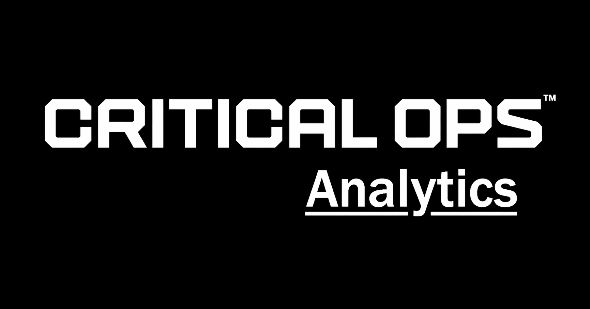
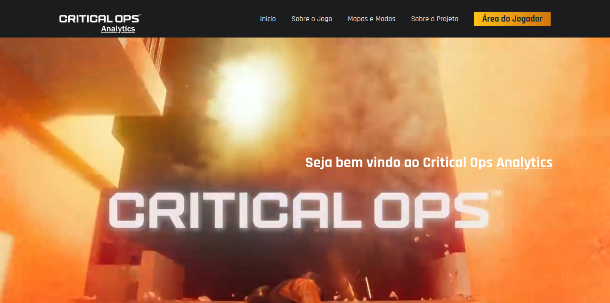
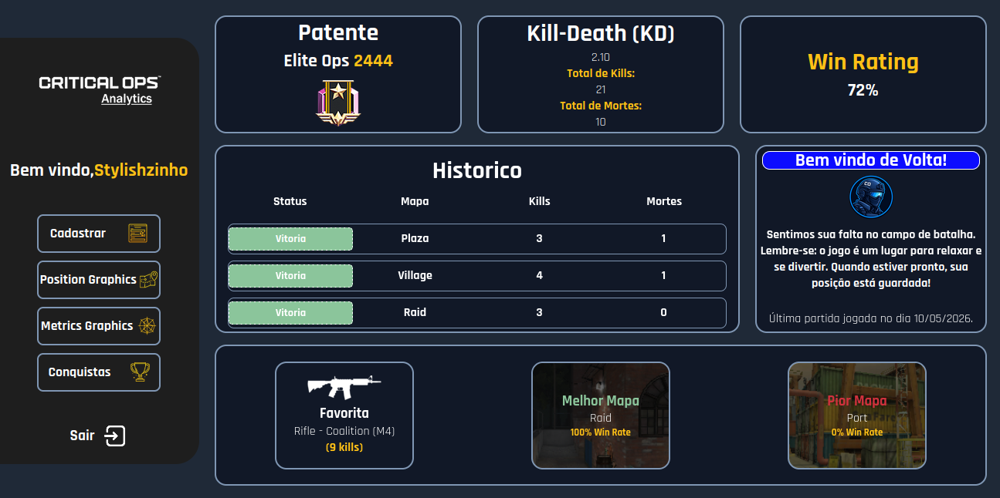
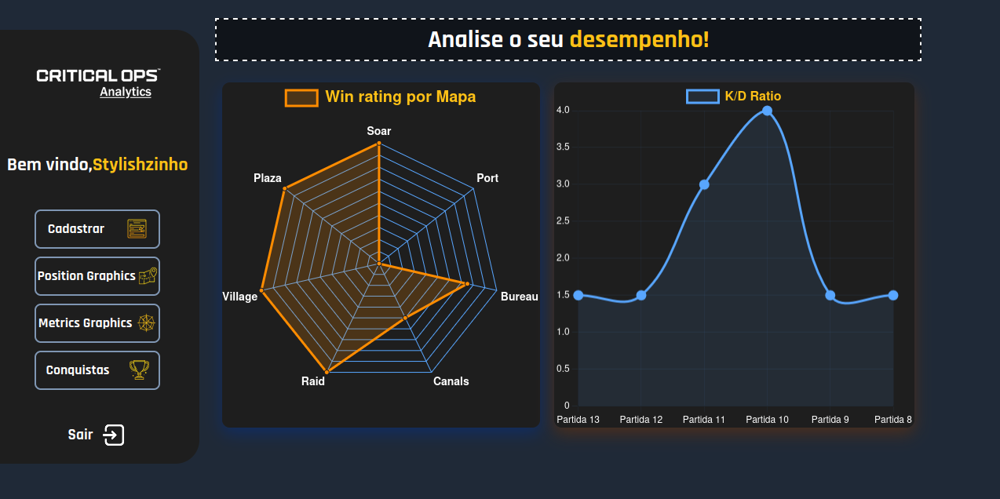
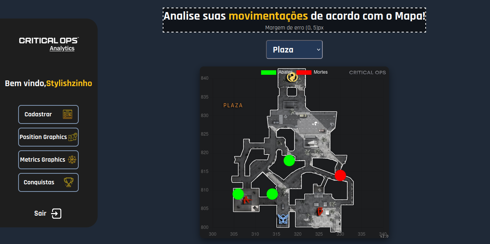
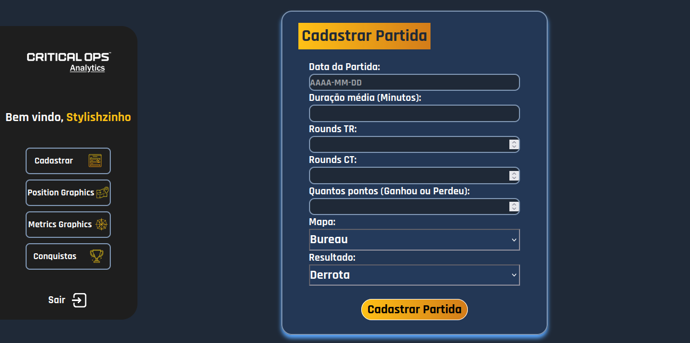

# 🎯 C-Ops Analytics

<div align="center">



<br><br>

## 📊 Transformando Gameplay em Performance Profissional

O **C-Ops Analytics** é uma plataforma de análise de desempenho criada para jogadores de **Critical Ops** que desejam evoluir de forma estratégica e alcançar um nível competitivo e profissional.

<br>


</div>

---

# 🧠 Sobre o Projeto

O **C-Ops Analytics** nasceu da necessidade de transformar a intuição dos jogadores em decisões baseadas em dados concretos.

A proposta da plataforma é oferecer uma experiência completa de análise individual para jogadores de **Critical Ops**, permitindo identificar padrões, evolução, desempenho e pontos de melhoria através de métricas avançadas e visualização inteligente de dados.

O projeto busca preencher a ausência de estatísticas avançadas dentro do jogo, entregando ao usuário uma visão **360° da sua performance individual**.

---

# 🎯 Objetivos

- 📈 Acompanhar evolução do jogador
- 🎮 Analisar desempenho individual
- 📊 Gerar métricas avançadas
- 🧠 Auxiliar na tomada de decisões estratégicas
- 🚀 Acelerar evolução competitiva
- 🏆 Aproximar jogadores do cenário profissional

---

# 🔥 Funcionalidades

## 📊 Dashboard Analytics

- Gráficos interativos
- Radar de habilidades
- Métricas de desempenho
- Evolução por partidas
- Estatísticas individuais
- Comparações de performance

---

## 🎯 Análise de Gameplay

- Precisão
- Consistência
- Evolução técnica
- Diagnóstico de performance
- Pontos fortes e fracos
- Performance em partidas

---

## 📈 Visualização de Dados

Utilizando o **Chart.js**, o sistema transforma dados brutos em análises visuais intuitivas e estratégicas.

Exemplos:

- Gráfico Radar
- Linha de evolução
- Barras comparativas
- Estatísticas em tempo real

---

# 🖥️ Tecnologias Utilizadas

## 🎨 Front-end

| Tecnologia | Função |
|---|---|
| HTML5 | Estrutura da aplicação |
| CSS3 | Estilização e responsividade |
| JavaScript | Interatividade e lógica |
| Chart.js | Visualização de dados |

---

## ⚙️ Back-end

| Tecnologia | Função |
|---|---|
| Node.js | Servidor e API |
| Express.js | Rotas e gerenciamento HTTP |

---

## 🗄️ Banco de Dados

| Tecnologia | Função |
|---|---|
| MySQL | Armazenamento de dados |

---

# 🏗️ Arquitetura do Projeto

```bash
C-Ops-Analytics/
│
├── public/
│   ├── css/
│   ├── js/
│   ├── assets/
│  
│
├── src/
│   ├── controllers/
│   ├── models/
│   ├── routes/
│   ├── database/
│   └── app.js
│
├── package.json
├── server.js
└── README.md
```

---

# 🚀 Como Executar o Projeto

## 📥 Clone o Repositório

```bash
git clone https://github.com/seu-usuario/c-ops-analytics.git
```

---

## 📂 Entre na Pasta do Projeto

```bash
cd c-ops-analytics
```

---

## 📦 Instale as Dependências

```bash
npm install
```

---

## ▶️ Execute o Projeto

```bash
npm start
```

---

# 📷 Preview do Projeto
## 🏠 Home



---

## 📈 Dashboard


---

## 📊 Métricas



---

## 📍 Position Graphic



---

## 📝 Cadastro de Partida



---

# 💡 Diferenciais do Projeto

O grande diferencial do **C-Ops Analytics** é transformar simples estatísticas em inteligência competitiva.

A plataforma entrega:

- 📊 Diagnóstico técnico
- 🎯 Interpretação de performance
- 📈 Evolução baseada em dados
- 🧠 Leitura estratégica de gameplay

Ao invés de apenas mostrar números, o sistema ajuda o jogador a entender:

- Onde está errando
- Onde está evoluindo
- Quais habilidades precisam de atenção
- Como melhorar sua gameplay

---

# 🎓 Projeto Acadêmico

Este projeto foi desenvolvido como parte do curso de **Ciência da Computação** da **SPTECH School**.

O objetivo é aplicar conceitos de:

- Desenvolvimento Web
- APIs REST
- Banco de Dados
- Visualização de Dados

---

# 👨‍💻 Desenvolvedor

<div align="center">

## Ancelmo Silva de Sousa

🎮 Entusiasta de FPS Competitivo  
💻 Estudante de Ciência da Computação - SPTECH

</div>


---

# ⭐ Contribuições

Contribuições são sempre bem-vindas.

Caso queira contribuir:

```bash
Fork 🍴
Clone 📥
Commit 🚀
Push 🔥
Pull Request 🎯
```

---

# 📄 Licença

Este projeto está sob a licença MIT.

---

<div align="center">

# 🏆 C-Ops Analytics

### "Dados transformam jogadores comuns em jogadores estratégicos."

<br>

⭐ Se gostou do projeto, considere deixar uma estrela no repositório.

</div>
